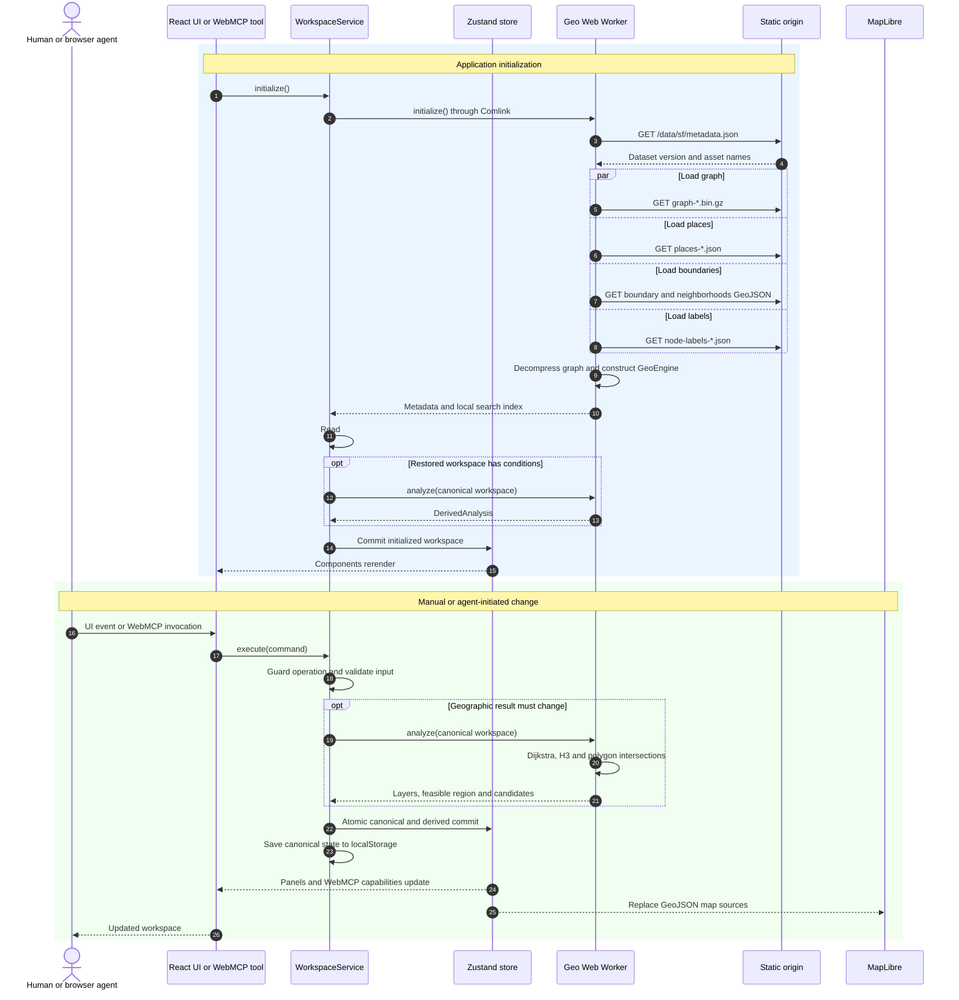

# SweetSpot architecture

SweetSpot is a static, client-side spatial-analysis application. There is no application backend, database, REST API, or GraphQL server: the browser downloads the application and San Francisco dataset, then performs the analysis locally in a Web Worker.

## System architecture

```mermaid
flowchart TB
    subgraph Clients["Supported clients"]
        Human["Human user<br/>Desktop or responsive browser"]
        Agent["Browser AI assistant<br/>WebMCP-capable browser"]
        Recipient["Shared-link recipient<br/>Same application version"]
    end

    subgraph Browser["Browser tab"]
        Router["App entry and lightweight routing<br/>/ = landing page<br/>/app or #w= = workspace"]

        subgraph React["React presentation layer"]
            Home["HomePage"]
            Onboarding["OnboardingPanel<br/>office search and sample"]
            Conditions["ConditionsPanel<br/>bike, grocery, park, drawing"]
            Results["ResultsPanel<br/>area and ranked candidates"]
            Activity["ActivityPanel<br/>history, undo, reset, sharing"]
            MapView["MapView<br/>MapLibre and TerraDraw"]
            MCPBridge["WebMCPBridge<br/>dynamic tool registration"]
        end

        Service["WorkspaceService<br/>command and query orchestrator"]
        Validation["Zod schemas<br/>input and workspace validation"]

        subgraph State["Zustand workspace store"]
            Canonical["Canonical state<br/>office, conditions, map view,<br/>combined flag, selection"]
            Derived["Derived state<br/>condition layers, feasible region,<br/>candidates, restriction"]
            Runtime["Runtime state<br/>operation, freshness, errors,<br/>activity and undo"]
        end

        subgraph BrowserAPIs["Browser integration"]
            Storage["localStorage<br/>autosaved canonical workspace"]
            Hash["URL fragment #w=<br/>compressed share state"]
            Clipboard["Clipboard API"]
            ModelContext["document.modelContext<br/>WebMCP tool surface"]
            Events["Custom browser events<br/>start and cancel drawing"]
            MapWorker["MapLibre rendering worker<br/>map rendering and interaction"]
        end

        GeoClient["Comlink worker client<br/>RPC over postMessage"]
    end

    subgraph AnalysisWorker["Dedicated geographic Web Worker"]
        WorkerAPI["GeoWorker API<br/>initialize and analyze"]
        Engine["GeoEngine"]
        Routing["Street graph algorithms<br/>bike Dijkstra<br/>walking multi-source Dijkstra"]
        Geometry["Turf and H3<br/>polygon creation, intersection,<br/>candidate generation"]
        Cache["50-entry condition cache"]
        SearchIndex["Bundled local search index"]
    end

    subgraph Origin["Static Vite / Vercel origin"]
        AppAssets["HTML, JavaScript, CSS,<br/>MapLibre workers"]
        Manifest["metadata.json"]
        Dataset["Versioned SF assets<br/>graph.bin.gz, places JSON,<br/>boundary and neighborhoods GeoJSON,<br/>node labels"]
    end

    subgraph External["External runtime services"]
        MapStyle["Map style and tiles<br/>MapTiler when configured<br/>otherwise OpenFreeMap"]
    end

    subgraph BuildTime["Offline data build pipeline"]
        OSM["OpenStreetMap<br/>PBF or pinned Overpass extract"]
        DataSF["DataSF<br/>boundary and neighborhoods"]
        Builder["build-osm-assets.ts<br/>validation, graph contraction,<br/>compression and checksums"]
    end

    Human --> Router
    Recipient -->|"opens #w= link"| Router
    Agent --> ModelContext

    Router --> Home
    Router --> Onboarding
    Router --> Conditions
    Router --> Results
    Router --> Activity
    Router --> MapView
    Router --> MCPBridge

    Onboarding -->|"commands and queries"| Service
    Conditions -->|"commands"| Service
    Results -->|"selection and removal"| Service
    Activity -->|"undo, reset, share"| Service
    MapView -->|"marker, map and drawing events"| Service
    MCPBridge -->|"agent commands and queries"| Service

    Service --> Validation
    Validation --> Service
    Service -->|"read and commit"| State
    State -->|"Zustand subscriptions"| React

    Service --> GeoClient
    GeoClient <-->|"Comlink RPC / structured clone"| WorkerAPI
    WorkerAPI --> Engine
    Engine --> Routing
    Engine --> Geometry
    Engine <--> Cache
    WorkerAPI --> SearchIndex

    WorkerAPI -->|"same-origin GET"| Manifest
    Manifest -->|"identifies versioned files"| Dataset
    Dataset --> WorkerAPI
    Origin -->|"initial static GET"| Router

    MapView <--> MapWorker
    MapView -->|"style and tile GET"| MapStyle
    MapView <--> Events
    Conditions --> Events

    MCPBridge <--> ModelContext
    Service <--> Storage
    Service <--> Hash
    Activity --> Clipboard

    OSM --> Builder
    DataSF --> Builder
    Builder --> Dataset
    Builder --> Manifest
```

## Runtime request and data flow

## Architectural boundaries

### 1. React components are presentation and interaction adapters

The panels and map do not independently calculate geographic results. They translate browser events into commands such as `set-office`, `add-bike`, `combine`, `select-candidate`, or `reset`.

Both manual UI actions and agent actions converge on the same `WorkspaceService`. This prevents the manual and WebMCP interfaces from developing different behavior.

The main component relationships are in [`src/app/App.tsx`](src/app/App.tsx).

### 2. `WorkspaceService` is the application core

[`src/domain/workspace-service.ts`](src/domain/workspace-service.ts) acts like an in-browser application server. It:

- Validates commands and enforces workflow rules.
- Prevents conflicting operations while calculating or drawing.
- Decides whether analysis needs to run.
- Calls the geographic worker.
- Commits the result to Zustand.
- Records whether the actor was a user or agent.
- Maintains one meaningful undo snapshot.
- Autosaves the canonical workspace.

There are two operation styles:

- `execute(...)` changes the workspace.
- `query(...)` reads data, searches the local index, explains candidates, or creates a share URL.

There is no HTTP request between a component and `WorkspaceService`; these are direct TypeScript calls in the browser.

### 3. Canonical and derived data are separated

The Zustand store in [`src/store/workspace-store.ts`](src/store/workspace-store.ts) contains:

- **Canonical state:** user-owned inputs such as office, conditions, drawing, map view, removed candidates and selection.
- **Derived state:** recomputable layers, feasible polygon, area, candidate ranking and restriction explanation.
- **Runtime state:** loading status, errors, activity, undo and freshness.

Only canonical state, activity and undo are saved or shared. Large derived GeoJSON results are recalculated locally. This keeps share links smaller and avoids treating stale calculations as authoritative.

### 4. Geographic work runs outside the React thread

[`src/geo-worker/client.ts`](src/geo-worker/client.ts) creates a dedicated module Web Worker. Comlink turns worker messages into an RPC-like `initialize()` and `analyze()` API.

The worker in [`src/geo-worker/worker.ts`](src/geo-worker/worker.ts) downloads the versioned static dataset and constructs the engine. The algorithm in [`src/geo-worker/engine.ts`](src/geo-worker/engine.ts) then:

1. Runs directional Dijkstra from the office for bicycle reachability.
2. Runs multi-source walking Dijkstra from every applicable grocery or park.
3. Samples reachable street edges and converts them into H3-based polygons.
4. Clips every condition to the San Francisco boundary.
5. Intersects all condition polygons to make the feasible region.
6. Generates candidate points inside that region.
7. Keeps candidates at least 300 metres apart.
8. Prioritizes the weakest normalized margin, then average margin.
9. Names candidates using DataSF neighborhoods and nearby OSM cross-streets.
10. Identifies the condition removing the most otherwise-feasible area.

Exact condition calculations are cached up to 50 entries.

### 5. The map is a browser adapter, not the analysis engine

[`src/map/MapView.tsx`](src/map/MapView.tsx) uses MapLibre for rendering and TerraDraw for polygon editing.

Interaction is bidirectional:

- Zustand changes cause the map's GeoJSON sources to be replaced.
- Clicking a candidate sends `select-candidate`.
- Dragging the office marker sends `set-office`.
- Moving the map sends `set-view`.
- Drawing or editing a polygon sends `add-preference`.
- Deleting a drawn polygon sends `delete-condition`.

MapLibre also uses its own rendering worker, separate from the SweetSpot geographic worker.

Only the visual base map depends on MapTiler or OpenFreeMap. Routing, search, ranking and candidate naming use the bundled data and remain local if tiles fail.

### 6. WebMCP is an additional browser interface

[`src/webmcp/WebMCPBridge.tsx`](src/webmcp/WebMCPBridge.tsx) checks for `document.modelContext`. When present, it registers tools that call the same service used by the human UI.

Tools are capability-gated using [`src/domain/capabilities.ts`](src/domain/capabilities.ts). For example:

- Bicycle tools appear only after an office exists.
- Combine appears after at least two conditions exist.
- Recalculate appears when results are stale.
- Candidate actions appear only when candidates exist.
- Undo appears only when an undo snapshot exists.

Abort controllers unregister tools whose preconditions are no longer true.

The current bridge registers **18 WebMCP tools**, although the README currently says 17.

## Network requests

| Request | Origin | Purpose |
| --- | --- | --- |
| HTML, JavaScript, CSS and workers | SweetSpot static origin | Load the application |
| `/data/sf/metadata.json` | Same origin | Discover the exact dataset version and filenames |
| Five versioned analysis assets | Same origin | Graph, places, boundary, neighborhoods and labels |
| Map style and tiles | MapTiler or OpenFreeMap | Visual background map only |
| Workspace commands | None | Direct in-browser function calls |
| Geographic analysis | None | Worker messages inside the browser |
| Location search | None | Search of the downloaded OSM index |
| Autosave | None | `localStorage` |
| Sharing | None when created | Compressed state stored in the URL fragment |

A URL fragment such as `#w=...` is not sent to the web server during an HTTP request. However, it contains the workspace data, so anyone receiving the link can decode and open that workspace.

## Supported clients

| Client | Support |
| --- | --- |
| Modern desktop browser | Full manual workspace |
| Responsive or mobile browser | Layout is designed for smaller screens, although automated E2E coverage currently targets desktop Chromium |
| Browser without WebMCP | Manual mode; all normal UI features remain available |
| WebMCP-capable browser assistant | Manual UI plus dynamically registered agent tools |
| Recipient of a share link | Can restore the workspace if its dataset version matches |
| Server-side API client, CLI or native app | Not directly supported; there is no public HTTP analysis API |
| Fully offline fresh browser | Not guaranteed; the application and dataset must first be obtained from the static origin, and base-map tiles require network access |

Production WebMCP additionally requires the correct origin-trial token and `Permissions-Policy` headers configured through [`vite.config.ts`](vite.config.ts) and [`vercel.json`](vercel.json).
